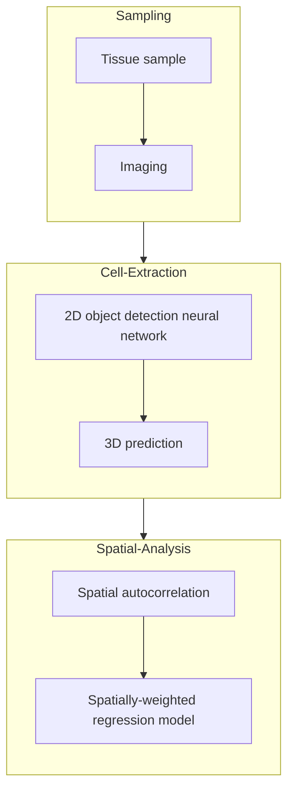

# PACESS

## Introduction

This is the repository of code for the PACESS paper

## Steps

```mermaid
flowchart TB

subgraph X[Sampling]
direction TB
    A[Tissue sample] --> B[Imaging]
end

subgraph Y[Cell-Extraction]
direction TB
    C[2D object detection neural network] --> D[3D prediction]
end

subgraph Z[Spatial-Analysis]
direction TB
    E[Spatial autocorrelation] --> F[Spatially-weighted regression model]
end

X --> Y --> Z


```