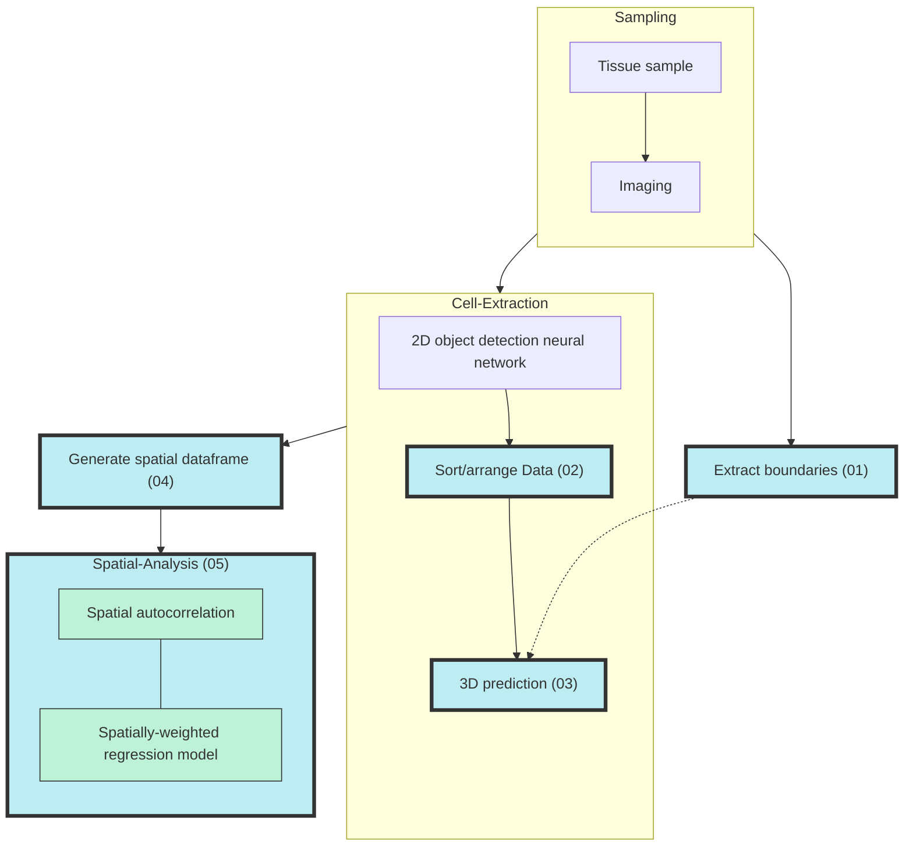

# PACESS

## Introduction

This is the repository of code for the PACESS paper. This contains a series of scripts which can be used for the pipeline described in the paper. The order of use of these scripts is shown in the diagram shown below.   

## Steps

