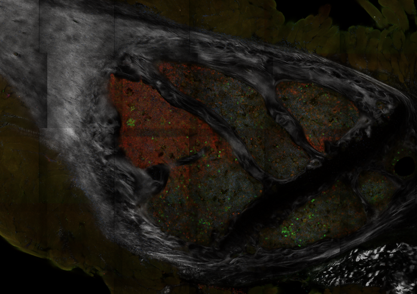
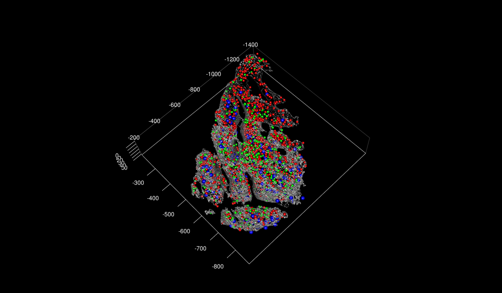

# PACESS 
### Practical AI-based Cell Extraction and Spatial Statistics
## Introduction

This is the repository of code for our paper; _**PACESS: Practical AI-based Cell Extraction and Spatial Statistics for large 3D biological images**_. This repository contains the relevant scripts for running the pipeline described in the paper. 

The aim of this paper was to describe a method for generating a 3D spatial data-frame of cellular information extracted from large multidimensional (>3D) biological images. Once extracted, we also describe in the paper a method for the analysis of this spatial data using a technique we've called 'spatially-weighted regression'. 

To give an understanding of how to The order of use of these scripts is shown in the diagram shown below. These scripts can be found in the following folders

```bash
 ── src
    ├── 01_tissueborders
    ├── 02_sort2DNNdata
    ├── 03_generate3dpredictions
    ├── 04_generate3dSpatialDataframe
    └── 05_spatial_analysis
        ├── spatial_analysis_examples
        └── spatially_weighted_regression_model
```

## Steps

The pipeline can as following the diagram (below). The scripts  <span style='color:#BDEDF2'> highlighted </span>. 


## Details (with image examples)

Starting with a base image (example shown below)




The purpose of <span style='color:#BDEDF2'> `01_tissueborders` </span> is to extract the contours of the tissue in question. To do this we start with a greyscale binary image of the cellular tissue: 


We then using the script in `02_tissueborders` This is important for removing unwanted cell locations outside of the tissue boundary which are not wanted for the spatial-modelling process. The output of this script is a geo-pandas dataframe of 2d contours, one for each z-layer within the image (see example below)


To then generate a set of 3D predictions we've organised the scripts in such a way that each step is as clear as possible. In <span style='color:#BDEDF2'> `02_sort2DNNdata (Sort/Arrange 02)` </span> we demonstrate how we order the output from the 2D neural networks by size and flourescence intensity. Because this requires referring back to the original image, we have created a specific script to show how this can be done. One this is done, <span style='color:#BDEDF2'> `03_generate3dpredictions` </span>  contains the script for generating the 3D predictions. 



To then run the _spatially weighted regression models_ on this data we use the output from <span style='color:#BDEDF2'> `03_generate3dpredictions` </span> along with the contour data ( from <span style='color:#BDEDF2'> `01_tissueborders` </span> ) to create a regular grid made up of $n \times n \times n$ grid-cells in which cell numbers are calculated. We then run our spatial models using scripts shown in <span style='color:#BDEDF2'> `05_spatial_analysis` </span> .

